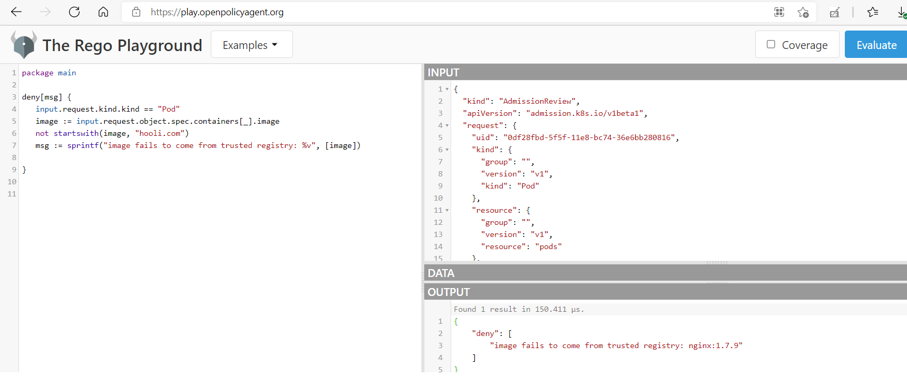

# Setup appropriate OS Leve security domains - PodSecurityPolicies, OPA, SecurityContext

## 01. PodSecurityPolicies
---

## 02. OPA
---
Its a CNCF project - https://www.openpolicyagent.org/ - focussed on ensuring simplicity in enforcing policies and a powerful yet very simplified policy authoring lifecycle. The Policy decision is made by OPA service - while Policy Enforcer can be anything. For example - a Spring Boot application in Java may use OPA to make some decisions but enforce it at the microservice level. The OPA service can run in many ways - a central service, a command line interpreter and a host of development, testing ecosystem of the policies. 

- When it comes to Kubernetes world - the policy enforcer is an admission controller. It works as a validating admission controller. So we configure a Validating Admission Controller in API server, with certificates and then run OPA itself as a Kubernetes Service and load Policy grammer (based on a DSL called REGO) is loaded as a ConfigMap. 
- We have a newer avatar of this - in form of OPA Gatekeeper for Kubernetes - which has more Kubernetes specific adoption (having a CRD concept and using a CRD named ConstraintTemplate  https://github.com/open-policy-agent/gatekeeper 
- A large library set https://github.com/open-policy-agent/gatekeeper-library

The way we can learn this subject is, 

- A. Use OPA and REGO as a standalone - without Kubernetes Integration
- B. Use OPA + Kubernetes API Server with Validating Admission Controller
- C. Use OPA gatekeeper - https://www.infoq.com/articles/implementing-policies-kubernetes/

### 02.A  Use OPA and REGO as a standalone - without Kubernetes Integration
---
Install OPA

```
ubuntu@ip-172-31-22-219:~/opa$ curl -L -o opa https://openpolicyagent.org/downloads/v0.29.4/opa_linux_amd64
  % Total    % Received % Xferd  Average Speed   Time    Time     Time  Current
                                 Dload  Upload   Total   Spent    Left  Speed
100    81  100    81    0     0    346      0 --:--:-- --:--:-- --:--:--   346
100   621  100   621    0     0    877      0 --:--:-- --:--:-- --:--:--   877
100 49.4M  100 49.4M    0     0  28.8M      0  0:00:01  0:00:01 --:--:-- 56.9M
ubuntu@ip-172-31-22-219:~/opa$ ls
opa
ubuntu@ip-172-31-22-219:~/opa$ chmod 755 opa

ubuntu@ip-172-31-22-219:~/opa$ ./opa version
Version: 0.29.4
Build Commit: f110489
Build Timestamp: 2021-05-31T09:52:36Z
Build Hostname: f90b55828cf8
Go Version: go1.16.3
WebAssembly: available

```
Select a Policy test case.

https://github.com/snowdrop/kubernetes-info-webhook/blob/master/src/test/resources/admission-review.json has a JSON - which is of admission review type - the same structure Kubernetes API server will send to OPA or any policy decision endpoint for a decision making.

I thought of using this and lets consider - we would like to stop the admission of this pod request - if it does not specify from a trusted registry limits. 

```
ubuntu@ip-172-31-22-219:~/opa$ cat test.rego
package opa.policy1

deny[msg] {
   input.request.kind.kind == "Pod"
   image := input.request.object.spec.containers[_].image
   not startswith(image, "hooli.com")
   msg := sprintf("image fails to come from trusted registry: %v", [image])

}


ubuntu@ip-172-31-22-219:~/opa$ ./opa eval -i payload.json -d test.rego data.opa.policy1.deny[msg]
{
  "result": [
    {
      "expressions": [
        {
          "value": "image fails to come from trusted registry: nginx:1.7.9",
          "text": "data.opa.policy1.deny[msg]",
          "location": {
            "row": 1,
            "col": 1
          }
        }
      ],
      "bindings": {
        "msg": "image fails to come from trusted registry: nginx:1.7.9"
      }
    }
  ]
}

```
we can test the same using Rego Playground
https://play.openpolicyagent.org/


### 02.B. Use OPA + Kubernetes API Server with Validating Admission Controller
---

Install OPA as a service in Kubernetes

Communication between Kubernetes and OPA must be secured using TLS. To configure TLS, use openssl to create a certificate authority (CA) and certificate/key pair for OPA:

```
ubuntu@ip-172-31-22-219:~$ kubectl create namespace opa
namespace/opa created

ubuntu@ip-172-31-22-219:~/opa/opa_in_k8s$ openssl genrsa -out ca.key 2048
Generating RSA private key, 2048 bit long modulus (2 primes)
.............+++++
........+++++
e is 65537 (0x010001)

ubuntu@ip-172-31-22-219:~/opa/opa_in_k8s$ openssl req -x509 -new -nodes -key ca.key -days 100000 -out ca.crt -subj "/CN=admission_ca"
Can't load /home/ubuntu/.rnd into RNG
139811024036288:error:2406F079:random number generator:RAND_load_file:Cannot open file:../crypto/rand/randfile.c:88:Filename=/home/ubuntu/.rnd

ubuntu@ip-172-31-22-219:~/opa/opa_in_k8s$ cat server.conf
ubuntu@ip-172-31-22-219:~/opa/opa_in_k8s/certs$ cat server.conf
[req]
req_extensions = v3_req
distinguished_name = req_distinguished_name
[req_distinguished_name]
[ v3_req ]
subjectAltName = @alt_names
basicConstraints = CA:FALSE
keyUsage = nonRepudiation, digitalSignature, keyEncipherment
extendedKeyUsage = clientAuth, serverAuth
[alt_names]
DNS.1   = opa.opa.svc


ubuntu@ip-172-31-22-219:~/opa/opa_in_k8s$ openssl genrsa -out server.key 2048
Generating RSA private key, 2048 bit long modulus (2 primes)
.......+++++
......................................+++++
e is 65537 (0x010001)
ubuntu@ip-172-31-22-219:~/opa/opa_in_k8s$ openssl req -new -key server.key -out server.csr -subj "/CN=opa.opa.svc" -config server.conf
ubuntu@ip-172-31-22-219:~/opa/opa_in_k8s$ openssl x509 -req -in server.csr -CA ca.crt -CAkey ca.key -CAcreateserial -out server.crt -days 100000 -extensions v3_req -extfile server.conf
Signature ok
subject=CN = opa.opa.svc
Getting CA Private Key

ubuntu@ip-172-31-22-219:~/opa/opa_in_k8s$ kubectl create secret tls opa-server --cert=server.crt --key=server.key
secret/opa-server created


```


Create a ValidatingWebhookConfiguration object in Kubernetes (this starts up the Validating Admission Controller dynamically)
Create a REGO policy in OPA namespace as a ConfiMap and OPA side car kube-mgmt will auto load the policy. 

```
ubuntu@ip-172-31-22-219:~/opa/opa_in_k8s/configmap_rules$ cat ingress-rules.rego
package kubernetes.admission

import data.kubernetes.namespaces

operations = {"CREATE", "UPDATE"}

deny[msg] {
        input.request.kind.kind == "Ingress"
        operations[input.request.operation]
        host := input.request.object.spec.rules[_].host
        not fqdn_matches_any(host, valid_ingress_hosts)
        msg := sprintf("invalid ingress host %q", [host])
}

valid_ingress_hosts = {host |
        whitelist := namespaces[input.request.namespace].metadata.annotations["ingress-whitelist"]
        hosts := split(whitelist, ",")
        host := hosts[_]
}

fqdn_matches_any(str, patterns) {
        fqdn_matches(str, patterns[_])
}

fqdn_matches(str, pattern) {
        pattern_parts := split(pattern, ".")
        pattern_parts[0] == "*"
        str_parts := split(str, ".")
        n_pattern_parts := count(pattern_parts)
        n_str_parts := count(str_parts)
        suffix := trim(pattern, "*.")
        endswith(str, suffix)
}

fqdn_matches(str, pattern) {
    not contains(pattern, "*")
    str == pattern
}

ubuntu@ip-172-31-22-219:~/opa/opa_in_k8s/configmap_rules$ kubectl -n opa create configmap ingress-rule --from-file=ingress-rules.rego

ubuntu@ip-172-31-22-219:~/opa/opa_in_k8s/test$ cat qa-namespace.yaml
apiVersion: v1
kind: Namespace
metadata:
  annotations:
    ingress-whitelist: "*.qa.acmecorp.com,*.internal.acmecorp.com"
  name: qa

ubuntu@ip-172-31-22-219:~/opa/opa_in_k8s/test$ kubectl create -f qa-namespace.yaml

ubuntu@ip-172-31-22-219:~/opa/opa_in_k8s/test$  kubectl create -f bad-ingress.yaml -n qa
Warning: extensions/v1beta1 Ingress is deprecated in v1.14+, unavailable in v1.22+; use networking.k8s.io/v1 Ingress
Error from server (invalid ingress host "acmecorp.com"): error when creating "bad-ingress.yaml": admission webhook "validating-webhook.openpolicyagent.org" denied the request: invalid ingress host "acmecorp.com"


```


### 02.C. Use OPA gatekeeper 
---

## 03. SecurityContext
---

A security context defines privilege and access control settings for a Pod or Container. It can be added in the Pod specification at a Pod spec level or Container level. These are some of the important facets on Security Context,

1. Discretionary Access Control: Permission to access an object, like a file, is based on user ID (UID) and group ID (GID).
2. Security Enhanced Linux (SELinux): Objects are assigned security labels.
3. Running as privileged or unprivileged.
4. Linux Capabilities: Give a process some privileges, but not all the privileges of the root user.
5. AppArmor: Use program profiles to restrict the capabilities of individual programs.
6. Seccomp: Filter a process's system calls.
7. AllowPrivilegeEscalation: Controls whether a process can gain more privileges than its parent process. This bool directly controls whether the no_new_privs flag gets set on the container process. AllowPrivilegeEscalation is true always when the container is: 1) run as Privileged OR 2) has CAP_SYS_ADMIN.
8. readOnlyRootFilesystem: Mounts the container's root filesystem as read-only.

In this section - I will detail Discretionary Access Control, Running as privileged or unprivileged, Linux Capabilities & AllowPrivilegeEscalation. We will discuss AppArmour and Seccomp in Section C - System Hardening and readOnlyRootFilesystem will be detailed in Section F - Ensure Immutability of container at runtime. 

### Test Pod
---

Lets build a Pod using BusyBox with with a sleep 1 day command. 

```
ubuntu@ip-172-31-22-219:~$ cat venus-pod.yaml
apiVersion: v1
kind: Pod
metadata:
  creationTimestamp: null
  labels:
    run: venus
  name: venus
spec:
  containers:
  - image: busybox
    name: venus
    command: ["sleep" , "1d"]
    resources: {}
  dnsPolicy: ClusterFirst
  restartPolicy: Always
status: {}

ubuntu@ip-172-31-22-219:~$ kubectl create -f venus-pod.yaml
pod/venus created

ubuntu@ip-172-31-22-219:~$ kubectl get pods
NAME                             READY   STATUS    RESTARTS   AGE
venus                            1/1     Running   0          72s

ubuntu@ip-172-31-22-219:~$ kubectl exec -it venus -- /bin/sh
/ # ps -aef
PID   USER     TIME  COMMAND
    1 root      0:00 sleep 1d
    6 root      0:00 /bin/sh
   11 root      0:00 ps -aef

```

### Running the Pod as different user
---

As we can see - the venus pod runs as root. This root user is not the root user of the host server, but at a container level. To run it as a separate user,we need to use securityContext. 

```
ubuntu@ip-172-31-22-219:~$ cat venus-pod.yaml
apiVersion: v1
kind: Pod
metadata:
  creationTimestamp: null
  labels:
    run: venus
  name: venus
spec:
  securityContext:
    runAsUser: 1000
    runAsGroup: 3000
    fsGroup: 2000
  containers:
  - image: busybox
    name: venus
    command: ["sleep" , "1d"]
    resources: {}
  dnsPolicy: ClusterFirst
  restartPolicy: Always
status: {}

ubuntu@ip-172-31-22-219:~$ kubectl create -f venus-pod.yaml
pod/venus created

ubuntu@ip-172-31-22-219:~$ kubectl exec -it venus -- /bin/sh

~ $ ps -aef
PID   USER     TIME  COMMAND
    1 1000      0:00 sleep 1d
    6 1000      0:00 /bin/sh
   13 1000      0:00 ps -aef
~ $ touch /tmp/test.txt
~ $ ls -l /tmp/test.txt
-rw-r--r--    1 1000     3000             0 Jun  5 15:34 /tmp/test.txt

```

### Running the Pod with Linux Capability
---

### Running the Pod with previledged true
---


https://gist.github.com/garethr/ea41afb1b6562cdb2b1555719f51f90e
https://medium.com/@mathurvarun98/how-to-write-great-rego-policies-dc6117679c9f
https://www.kubermatic.com/blog/opa-rego-in-a-nutshell/
https://thenewstack.io/5-things-you-didnt-know-about-open-policy-agent/
https://www.openshift.com/blog/better-kubernetes-security-with-open-policy-agent-opa-part-1
https://www.velotio.com/engineering-blog/deploy-opa-on-kubernetes
https://www.openpolicyagent.org/docs/v0.11.0/guides-kubernetes-admission-control/
https://www.openpolicyagent.org/docs/v0.12.2/kubernetes-admission-control/#4-define-a-policy-and-load-it-into-opa-via-kubernetes
https://itnext.io/open-policy-agent-opa-up-and-running-9220ff591fa1
https://medium.com/@maduranga.siriwardena/evaluating-opa-policy-with-rest-api-71e49f120547
https://www.openpolicyagent.org/docs/v0.12.2/kubernetes-admission-control/#4-define-a-policy-and-load-it-into-opa-via-kubernetes

./opa run -s ./test.rego ./payload.json
